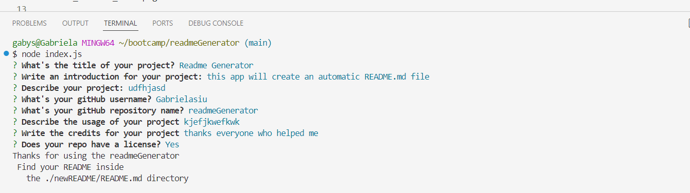
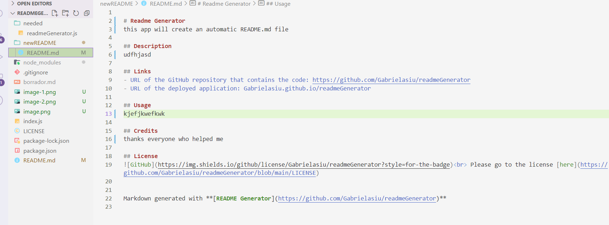

# readmeGenerator

## Description

README Generator is an app created by and for students, coworkers and any 
user who may need to create a README.md file. 
Using nodejs I was able to create a README file that would be fill up automatically 
with the inputs from the user. I use one of my other projects README file as an example of 
what i want my generated README file to look like. 
I added a Title, Description, links, usage, credits and license, which i think are the most important things 
to add in a README file.  

For the creation of this website I use my recently learn knowledge in NODEjs and javascript logic. 

## Links 

Link to my walkthrough video: https://drive.google.com/file/d/1nyJNWh7Kue9g6Oj3-fNW_DigMH3qzxum/preview

Link to my GitHub Repository: https://github.com/Gabrielasiu/readmeGenerator.git 

## Usage: 

To be able to use this readmeGenerator, youll have to open the terminal on the file's correcto location. Once you are in the readmeGeneration file, youll write "node index.js" and youll be able to start adding your input in the questions. 

## Credits: 

Special thanks to our instructor Chris Stallcup and TA Brittani Court for the support and advice provided. Also to my friend Rod for helping me with this project. The page has been designed, structured and developed by Gabriela Siu. 

## License
MIT License used for this repository.

## Screenshots

Terminal usage: 
Files used and README.md created with the generator 

